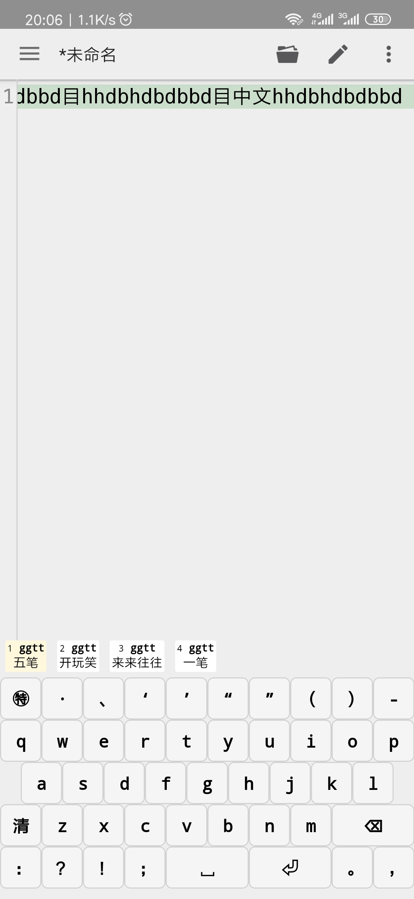
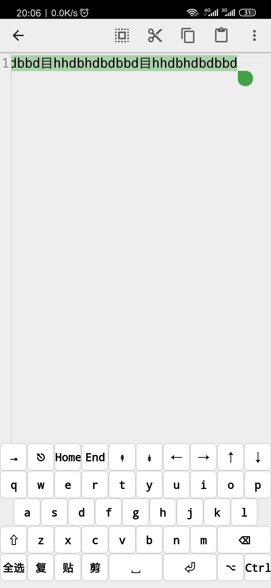
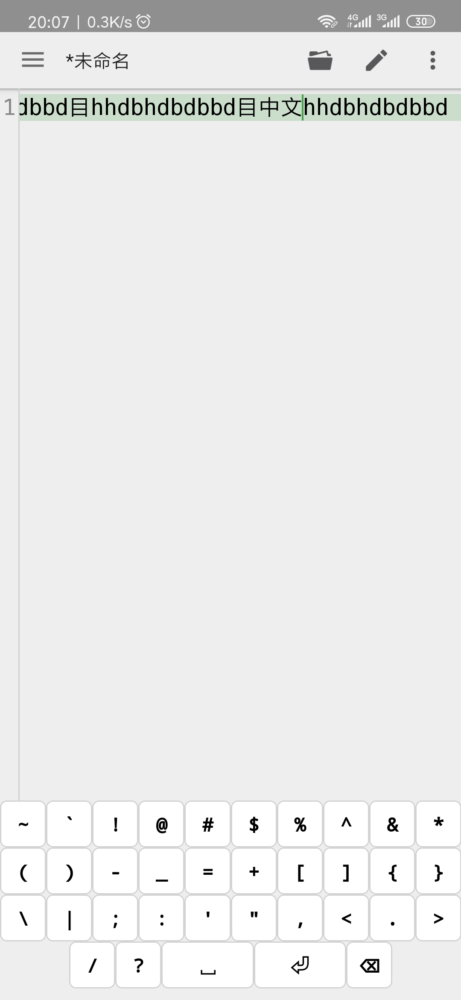
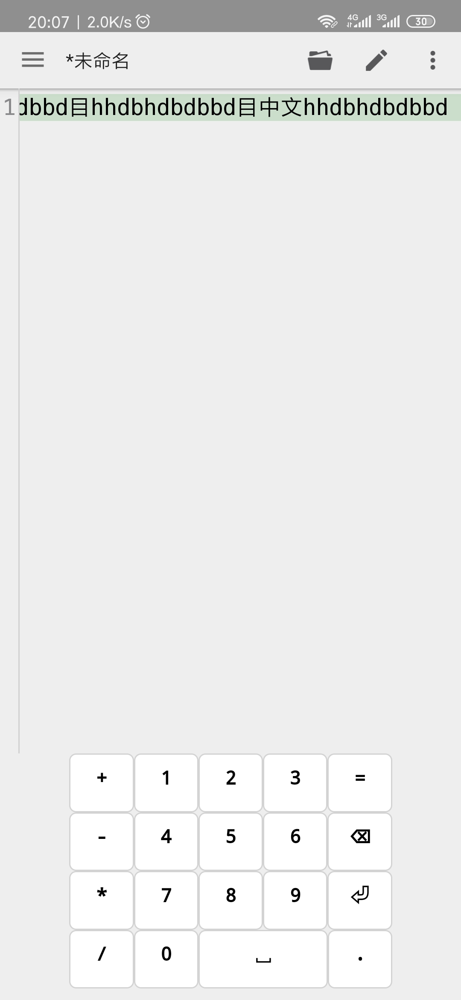
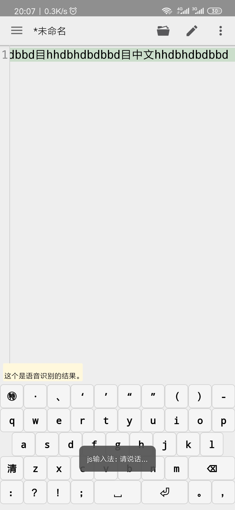

# android SoftKeyboard  

*. 支持自定义。键盘纯html语音实现，支持通过css自定义样式、更多功能实现 
*. 支持语音输入 
*. 目前中文只自带五笔，若需要其它中文请参考自行实现。一般直接拿来码表，调整下五笔匹配即可 
*. 支持手势控制 
*. 支持完整pc控制功能，比如ctrl、alt、ctrl+c等 
*. 更多功能可以通过修改html来实现 

# 截图 

 
 
 
 
 

