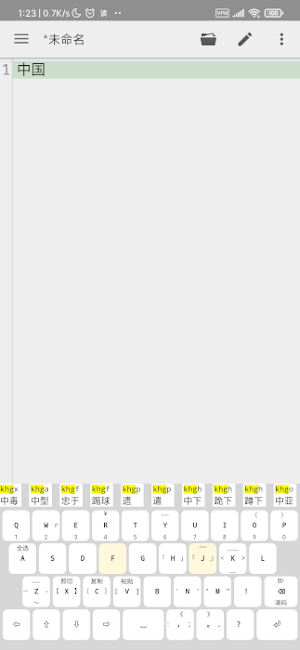
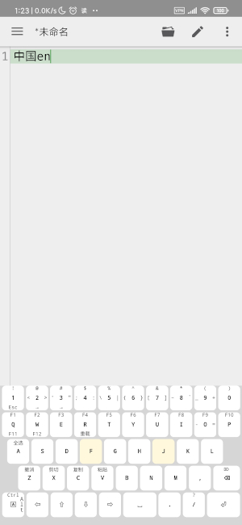
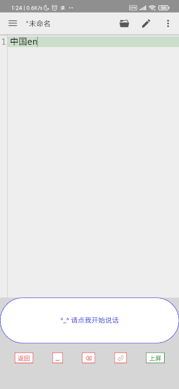

# android SoftKeyboard  

*. 支持自定义。键盘纯html语言实现，支持通过css自定义样式、更多功能实现   
*. 支持语音输入，需要安装tts，比如讯飞语记    
*. 目前中文只自带五笔，若需要其它中文请参考自行实现。一般直接拿来码表，调整下五笔匹配即可   
*. 支持手势控制   
*. 支持完整pc控制功能，比如ctrl、alt、ctrl+c等   
*. 更多功能可以通过修改html来实现   
*. 项目github https://github.com/qidizi/android-js-ime  
*. 测试环境：小米9+android 10、模拟器中的android 9  

# 感谢  

*. 感谢[JetBrains](https://www.jetbrains.com/?from=android-js-ime)，为本开源项目免费提供全家桶的授权码    
*. 感谢[qq输入法](http://qq.pinyin.cn/)提供五笔码表；

# 自己使用的键盘截图 

   
   
   
   

